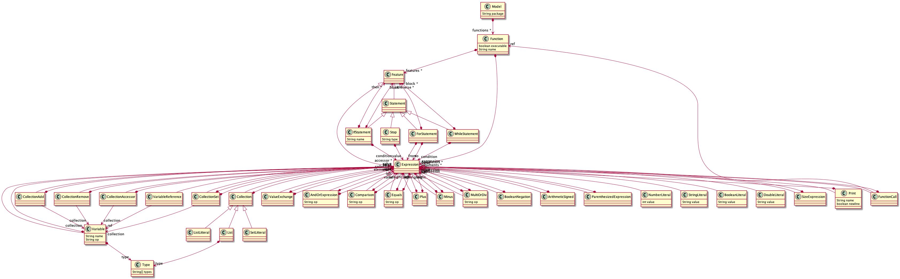

# Mush Ecore model

> Ecore model defenition for the Mush language

This project defines an Ecore model of the Mush language. 

In the `model`folder, you will find the ecore model and the generator model. The `src/tdt4250/mush/model` folder contains all the generated model code.

## Table of Contents
- [Table of Contents](#table-of-contents)
- [Domain Model](#domain-model)
  - [Description](#description)
  - [Model Hierarchy](#model-hierarchy)
## Domain Model

### Description

Some description here...

### Model Hierarchy

