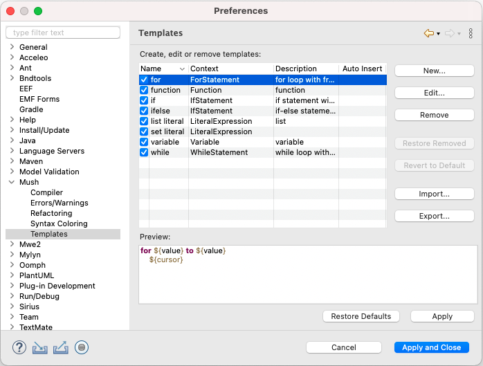

# Xtext UI

> UI for Xtext Eclipse plugin

This project provides an Eclipse plugin that contributes an Eclipse editor for Mush.

## Table of Contents
- [Table of Contents](#table-of-contents)
- [Project Structure](#project-structure)
  - [Java packages (src/)](#java-packages-src)
  - [Generated files (src-gen/)](#generated-files-src-gen)
  - [Templates](#templates)
- [Templates](#templates-1)
- [Running Eclipse Plugin](#running-eclipse-plugin)
  - [Prequisites](#prequisites)
  - [Setup Run Configuration](#setup-run-configuration)

## Project Structure

### Java packages ([src/](src/))
The src folder contains all the Xtext UI related files and folders. Several Java packages are located here. These are mostly generated by Xtext.

### Generated files ([src-gen/](src-gen/))
Generated Java files are located in the src-genfolder.

### Templates
Code templates are available in the [`templates.xml`](templates/templates.xml) file.

## Templates
Mush ships with several default code templates. These are compatible with Xtext-based editors. Following is a screenshot of the available templates.

## Running Eclipse Plugin

### Prequisites

You should already have Eclipse installed, and at least use Java 8 JDK.

### Setup Run Configuration

1. Import all the modules into an Eclispe Workspace.

2. Right-click the `tdt4250.mush.xtext.ui` module and select `Run Configurations...` under `Run As`.

3. In the popup window, right-click `Eclipse Application` and select `New Configuration`  in order to create a new runnable Eclipse configuration.

4. Enter the following configuration options in the `Main` tab, as shown in the image below:

5. In the `Plug-ins` tab, ensure that the `Launch with` option is set to `all workspace and enabled target plug-ins`. This is shown in the image below.

6. Click `Run` to start an new Eclipse with the Mush plugins installed.
