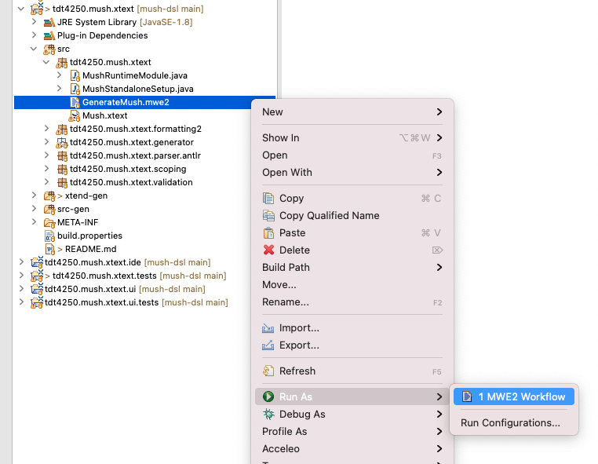

# Mush Xtext Core

> Core Mush implementation

## Table of Contents
- [Table of Contents](#table-of-contents)
- [Build](#build)
- [Language syntax](#language-syntax)
	- [Package Declaration](#package-declaration)
	- [Functions](#functions)
	- [Types](#types)
	- [Variables](#variables)
	- [Collections](#collections)
		- [Retrieve element from list](#retrieve-element-from-list)
		- [Add elements to list](#add-elements-to-list)
		- [Remove elements from list](#remove-elements-from-list)
		- [Swap places of elements in list](#swap-places-of-elements-in-list)
		- [Change element in a place in the list](#change-element-in-a-place-in-the-list)
		- [Find the size of the list](#find-the-size-of-the-list)
	- [Statements](#statements)
		- [While statements](#while-statements)
		- [For statements](#for-statements)
		- [If statements](#if-statements)
	- [Stop statements](#stop-statements)
	- [Expressions](#expressions)
		- [Print expressions](#print-expressions)
		- [Arithmetic expressions](#arithmetic-expressions)
		- [Comparing operators](#comparing-operators)

## Build
Right click on the `GenerateMush.mwe2` in the core xtext bundle, and select `Run As` -> `MWE2 Workflow`.



## Language syntax
Mush is a simplified code language based on multiple programming languages (Java, Python etc.). It allows for a greater use of pseudocode like syntax, hence making it more natural to read and write, therefore there are multiple ways to write the same code. The language is whitespace aware, making use of indentations to create structure (like Python). It compiles down to Java code. 

Due to the language’s nature, it makes a great candidate for beginners to learn programming. Yet, it is powerful enough to for example try out algorithms, which is often expressed in a pseudo like syntax. We have used the book “Introduction to ALGORITHMS, 3.rd edition” as inspiration. 


### Package Declaration
The language allows the use of packages. To use a packages write package and the package name. This way all the generated java code with the same package name is inside the same package. ```package world```

### Functions
To use functions write the function name with parentheses behind. If the function requier inputs, these have to be inserted between the parentheses. All inputs has to start with a declaration of the type. This can be number, text, decimal, list with numbers, list with list with text ect. All content has to be inside a function.\ 
`Person()``Person(number year, text name, decimals height)`\
To get the code to run, write executable before the function name. This way the code will get a run method calling the function.`executable Person()`

```
HelloWorld(text language)
	theText equals “”
if language != “english” then
		theText equals “Hello World”
else
		theText equals  “Hei Verden”
	return theText

executable Main()
	language equals “english”
	print line HelloWorld(theText)

```
### Types
text \
number \
decimal \
list with number \
list with text


### Variables 
When defining variables write the name of the variables, an equal and what it is. The different ways to write equals are `=`, `equals` og `is`
```
year = 1
```
```
year is 3
```
```
year equals 1
```
```
name = “Hanne”
```

### Collections
Different ways to write collections are `array`,`list` and `table`. There are tree types of collection syntax. One that use sets, and two that use lists. For the lists one can have empty list and one can not.\ 
This collection syntaxes has to have lists with at least one elemnt, so the list can not be empty.
```
B = [1,2,3,4]
B = [[1,2],[3,5]]
```
```
B = {1,2,4} //all elements will be unique
```
This collection syntax does allow empty lists.
```
B is new list with number //empty list
B is new list with number that contains 1,3,5
B equals new table with text that contains “hanne”, “petter”
```
#### Retrieve element from list
```
B at 0 //will retrieve the 0 element in the list
B[0] //will retrieve the 0 element in the list
```

#### Add elements to list
```
B add 1 //will add 1 to the list B
```
#### Remove elements from list
```
B remove 2 //will remove element on place 2
```
#### Swap places of elements in list
```
B = [1,2,3,4] //before
exchange B at 0 with B at 2
B = [3,2,1,4] //after
```

#### Change element in a place in the list
```
B set 0 to 9 //this will set the number 9 on place 0 in the list
B set 0,1 6 //this will set the number 6 on row 0 column 1
```
#### Find the size of the list
```
size of B //get the length of the rows
```
If the list is 2 dimensions:
```
size of (B[0]) //get the length of the columns
```

### Statements

#### While statements
```
while name != “Hanne”
	print name
```
#### For statements
```
for 0 to 10
	print "Hello"
```

```
for interval 2 to (size of B) 
	print "Hello"
```
#### If statements
```
if language != “english” then
	print “Hello World”
else
	print “Hei Verden”
```

```
if language != “english” then
	print “Hello World”
	if 2 != nr then
		print “Hello London”
	else
		print “Hello New York”
else 
	print "Hei Verden"
	if 2 >= year then
		print “Hei Trondheim”
	else
		print “Hei Oslo”

```

### Stop statements
In a function or a statement it is possible to jump out of parts of the code or return variables, text or numbers. The stop statements can be used but are not necessary for the code syntax.

```
return “and the statement you want to return” 
```
```
break //wil break out of the loop
```
```
continue //wil jump to next iteration of the loop
```
```
stop //is used to signal that a loop or a function has ended, 
//after stop in the other blok of the function, there are not allowed to write more code
```

### Expressions
#### Print expressions
```
print «expression»
```
```
print line «expression» //line is used to get new line after the print
```
```
print “hello world”
```

#### Arithmetic expressions
The Arithmetic expressions have for some expressions multiple ways to write the same thing. The table describes a psudo alternative and a standard alternative mush can be witten as.
 pseudo | standard 
 -|-
 plus | + 
 minus | - 
 divid | / 
 modulo | % 
 times | * 
 ||++|
 ||--|
 ||=+|
 ||=-|
 ```
 name = "Hanne" + " " + "Pettersen"
 ```
```
year = 3*2
```
```
year++
```
```
year equals 0 divid 2
```
```
year = 9 modulo 2
```
 
#### Comparing operators
The Comparing  operators have for some operators multiple ways to write the same thing. thingThe table describes a psudo alternative and a standard alternative mush can be witten as.
 pseudo | standard 
 -|-
lessThen | <
biggerThen | >
and | &
or | \|
| | <= | 
| | >= | 
| | == |
| | != |


